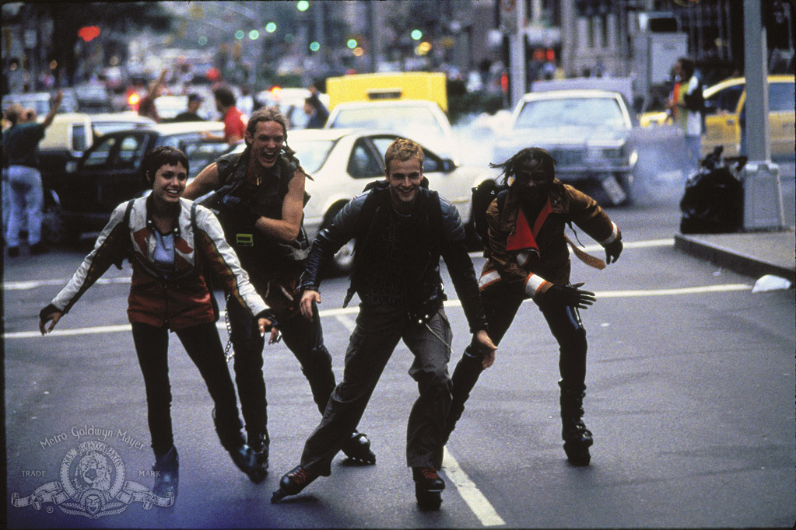

<table>
  <tr>
    <td>
      
    </td>
    <td>
      
👋 Hi, I’m @apple-fritter 🍏🍩

      
🚌 Join me in the adventure of van life and embrace the freedom of the open road! 🚐💨

      
👀 As an explorer of the digital realm, I'm passionate about programming, Linux, Internet Relay Chat, education, nature, and being kind. 🌍💻✨

      
🌱 Currently, I'm on a thrilling journey of mastering GitHub. It's an exhilarating experience, and I'm even coding on the go with my mobile! So please bear with me as I update. ⚡📱

      
💞️ I’m eagerly seeking collaborative projects that empower education, assist individuals with impairments, and stimulate active and meaningful communication. I'm particularly excited about exploring the endless possibilities of Rust 🦀. I'm also captivated by the realms of machine learning and NLP. Let's innovate together! 🤝🚀

      
📫 Reach out to me and become a part of my endeavors through my <a href="http://linktr.ee/apple_fritter">linktree</a>. Feel free to contribute to my causes and let's make a positive impact on the world! 🌟🙌

      
😵 I'm a regular visitor of tech havens like <a href="https://slashdot.org/">SlashDot</a>, <a href="https://distrowatch.com/">DistroWatch</a>, and <a href="https://news.ycombinator.com/">Hacker News</a>. If you have an intriguing tech blog that you'd love to share, I've got room for it in my bookmarks! Let's exchange knowledge and expand our horizons! 📚💡

    </td>
  </tr>
</table>
